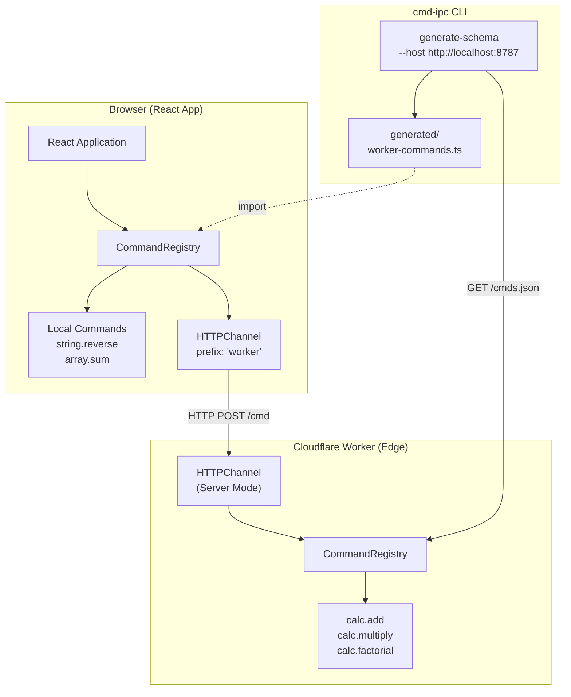

import { Aside } from '@astrojs/starlight/components';

The Cloudflare Workers example demonstrates HTTP-based command communication using the HTTPChannel, with remote schema generation for type-safe client development.

## Architecture



## Overview

This example includes:

- **Cloudflare Worker** serving commands via HTTP at the edge
- **React frontend** consuming commands with full type safety
- **CLI schema generation** from the running worker
- **Local commands** (string, array operations) merged with remote schemas
- **Monorepo structure** separating worker and frontend packages

## Project Structure

```
examples/cf-worker/
├── package.json
└── packages/
    ├── worker/                 # Cloudflare Worker
    │   ├── wrangler.toml       # Worker configuration
    │   └── src/
    │       ├── index.ts        # Worker entry
    │       ├── command-schema.ts
    │       └── services/
    │           └── calc-service.ts
    └── frontend/               # React application
        ├── vite.config.ts
        └── src/
            ├── main.tsx
            ├── App.tsx
            ├── schemas/
            │   ├── commands-schema.ts   # Local commands
            │   └── generated/           # CLI-generated remote schemas
            │       └── worker-commands.ts
            └── services/
                ├── string-service.ts
                └── array-service.ts
```

## Running the Example

```bash
yarn start:examples-cf-worker
```

Open http://localhost:5174 to see the application.
