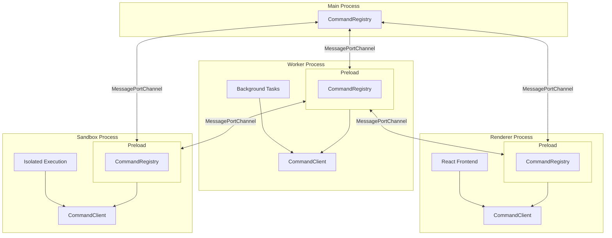

import { Aside } from '@astrojs/starlight/components'

The <a href="https://www.electronjs.org/" target="_blank" rel="noopener">Electron.js</a> example demonstrates a multi-process Command IPC architecture for building extensible, performant Electron.js apps. This approach is inspired by <a href="https://archive.jlongster.com/secret-of-good-electron-apps" target="_blank" rel="noopener">James Long's blog post</a> on architecting Electron apps to avoid blocking the main/renderer process for long-running tasks. It uses Electron's <a href="https://www.electronjs.org/docs/latest/tutorial/message-ports" target="_blank" rel="noopener">MessagePorts</a> for efficient IPC between processes.

## Architecture



## Overview

This example implements a reference architecture where:

- A **background worker process** provides the core backend functionality of the app
- A **sandbox process** runs in a secure sandboxed window for isolated execution
- The **renderer process** provides the main UI visible to the user
- Each process registers commands on start-up, which can be called from any other process
- A **preload script** shared by all windows provides an API to register commands and route requests
- Processes can emit **events** that other processes can listen for to update their local state
- Child processes connect directly to the worker for frequently called commands, reducing routing overhead

This architecture makes it easy to extend the app with new commands, split tasks to different processes for performance, and forms the basis of an extension model similar to VSCode.

## How it Works

### Channel Setup

When a window loads, the main process creates a `MessageChannelMain` and sends one port to the window while keeping the other for its own channel:

```typescript
// Main process creates channels when window loads
window.webContents.on('did-finish-load', () => {
  const { port1, port2 } = new MessageChannelMain()

  // Send port1 to the window's preload script
  window.webContents.postMessage('REGISTER_NEW_CHANNEL', 'main', [port1])

  // Register port2 with the main CommandRegistry
  const channel = new MessagePortMainChannel(id, port2)
  CommandsRegistryMain.registerChannel(channel)
})
```

### Preload Script

Each window shares a preload script that creates its own `CommandRegistry` and exposes it to the renderer via `contextBridge`. The preload listens for channel registration events from the main process:

```typescript
// Preload creates a CommandRegistry with schemas
const commandRegistry = new CommandRegistry({
  routerChannel: 'main',
  schemas: { commands: AppCommandSchema, events: AppEventSchema },
})

// Expose registry methods to renderer as window.commands
contextBridge.exposeInMainWorld('commands', {
  executeCommand: commandRegistry.executeCommand.bind(commandRegistry),
  registerCommand: commandRegistry.registerCommand.bind(commandRegistry),
  onEvent: commandRegistry.onEvent.bind(commandRegistry),
  // ...
})

// Listen for new channels from main process
ipcRenderer.on('REGISTER_NEW_CHANNEL', (event, id: string) => {
  const [port] = event.ports
  const channel = new MessagePortChannel(id, port)
  commandRegistry.registerChannel(channel)
})
```

### CommandClient

The `CommandClient` in the core package provides a type-safe wrapper around `window.commands`. It also includes an `isReady()` method that waits for specified channels to be registered before executing commands:

```typescript
// CommandClient wraps window.commands for type-safe access
export const CommandClient = {
  executeCommand: async (command, ...args) => {
    return await window.commands.executeCommand(command, ...args)
  },

  isReady: async (channels: ChannelID[]): Promise<void> => {
    // Polls until all specified channels are registered
    // Useful for waiting on background processes to connect
  },
}
```

### Direct Process Connections

For performance, child processes can connect directly to each other. For example, the renderer can have a direct channel to the worker process, bypassing the main process for frequently called commands:

```typescript
// Main process sets up direct worker-to-renderer channel
const { port1, port2 } = new MessageChannelMain()
workerWindow.webContents.postMessage('REGISTER_NEW_CHANNEL', 'renderer', [port1])
rendererWindow.webContents.postMessage('REGISTER_NEW_CHANNEL', 'worker', [port2])
```

## Project Structure

```
examples/electron/
├── package.json
├── tsconfig.base.json
└── packages/
    ├── core/                   # Shared types and schemas
    │   └── src/
    │       └── schemas/
    ├── main/                   # Electron main process
    │   └── src/
    │       └── services/
    ├── frontend/               # Electron renderer (React)
    │   └── src/
    ├── worker/                 # Background worker process
    │   └── src/
    └── sandbox/                # Sandboxed execution environment
        └── src/
```

## Running the Example

```bash
yarn start:examples-electron
```
