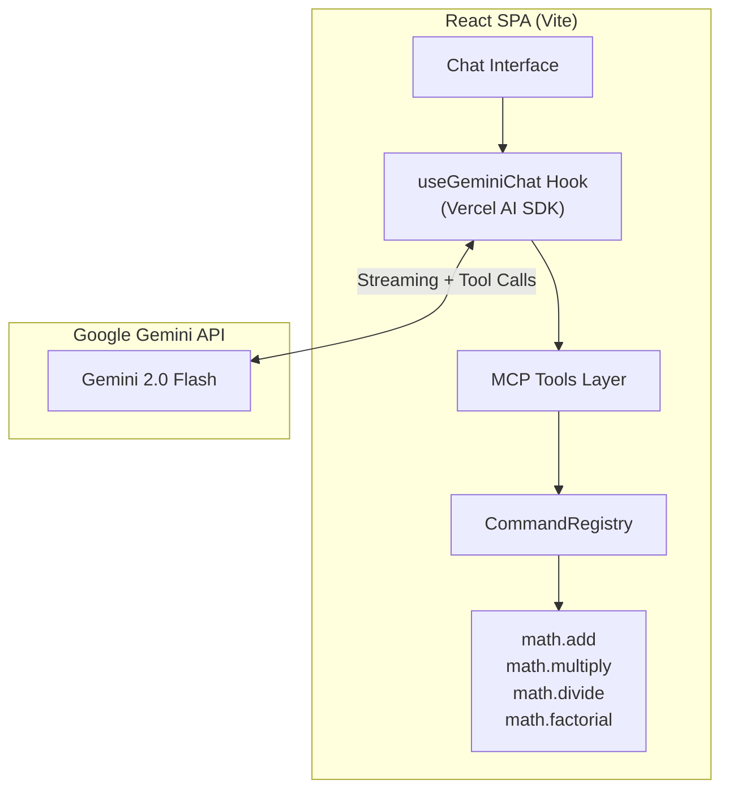

import { Aside } from '@astrojs/starlight/components';

The AI Agent MCP example demonstrates how to expose cmd-ipc commands as tools for AI agents. It uses the <a href="https://sdk.vercel.ai/" target="_blank" rel="noopener">Vercel AI SDK</a> to integrate with Google Gemini, showing how commands can be easily converted to tools for any AI agent framework.

## Architecture



## Overview

This example includes:

- **Pure client-side React SPA** (no backend required)
- **Real-time streaming chat** with Google Gemini 2.0 Flash
- **Commands exposed as tools** via cmd-ipc CommandRegistry
- **Multi-step tool execution** (AI can call tools and respond based on results)
- **Tool calls and results** displayed in the chat UI
- **Markdown rendering** with syntax highlighting
- **Token usage tracking**

## Project Structure

```
examples/agent-mcp/
├── package.json
├── vite.config.ts
├── index.html
├── .env.example
└── src/
    ├── main.tsx
    ├── App.tsx               # Chat interface
    ├── styles.css
    ├── agent/
    │   ├── useGeminiChat.ts  # Chat hook with AI SDK
    │   └── list-tools.ts     # Converts commands to AI SDK tools
    └── commands/
        ├── command-registry.ts
        ├── command-schema.ts
        └── command-handlers.ts
```

## Running the Example

```bash
yarn start:examples-agent-mcp
```

Open http://localhost:5173 and enter your Google AI API key.

## Converting Commands to AI Tools

The key to integrating cmd-ipc with AI agents is converting commands to the tool format expected by the AI SDK. The `listCommands()` method provides all the information needed:

```typescript
// list-tools.ts
import type { ToolSet } from 'ai'
import { z } from 'zod'
import { CommandRegistry } from './command-registry'

export function listTools(): ToolSet {
  const commands = CommandRegistry.listCommands()

  const tools: ToolSet = {}
  for (const command of commands) {
    tools[command.id] = {
      description: command.description,
      inputSchema: command.schema?.request
        ? z.fromJSONSchema(command.schema.request)
        : z.unknown(),
      outputSchema: command.schema?.response
        ? z.fromJSONSchema(command.schema.response)
        : z.unknown(),
      execute: async (input) => {
        return await CommandRegistry.executeCommand(command.id, input)
      },
    }
  }

  return tools
}
```

### Using with Vercel AI SDK

```typescript
import { streamText } from 'ai'
import { google } from '@ai-sdk/google'
import { listTools } from './list-tools'

const result = await streamText({
  model: google('gemini-2.0-flash'),
  tools: listTools(),
  maxSteps: 5,  // Allow multi-step tool execution
  messages: [{ role: 'user', content: 'What is 5 factorial?' }],
})
```

### Using with OpenAI SDK

```typescript
import OpenAI from 'openai'

const openai = new OpenAI()
const commands = CommandRegistry.listCommands()

// Convert to OpenAI tool format
const tools = commands.map(cmd => ({
  type: 'function' as const,
  function: {
    name: cmd.id,
    description: cmd.description,
    parameters: cmd.schema?.request || { type: 'object', properties: {} },
  },
}))

const response = await openai.chat.completions.create({
  model: 'gpt-4',
  tools,
  messages: [{ role: 'user', content: 'What is 5 factorial?' }],
})

// Handle tool calls
for (const toolCall of response.choices[0].message.tool_calls || []) {
  const args = JSON.parse(toolCall.function.arguments)
  const result = await CommandRegistry.executeCommand(toolCall.function.name, args)
  // Send result back to model...
}
```

### Using with Anthropic SDK

```typescript
import Anthropic from '@anthropic-ai/sdk'

const anthropic = new Anthropic()
const commands = CommandRegistry.listCommands()

// Convert to Anthropic tool format
const tools = commands.map(cmd => ({
  name: cmd.id,
  description: cmd.description,
  input_schema: cmd.schema?.request || { type: 'object', properties: {} },
}))

const response = await anthropic.messages.create({
  model: 'claude-sonnet-4-20250514',
  max_tokens: 1024,
  tools,
  messages: [{ role: 'user', content: 'What is 5 factorial?' }],
})

// Handle tool use
for (const block of response.content) {
  if (block.type === 'tool_use') {
    const result = await CommandRegistry.executeCommand(block.name, block.input)
    // Send result back to model...
  }
}
```

### Using with LangChain

```typescript
import { tool } from '@langchain/core/tools'
import { z } from 'zod'
import { ChatOpenAI } from '@langchain/openai'

const commands = CommandRegistry.listCommands()

// Convert commands to LangChain tools
const tools = commands.map(cmd =>
  tool(
    async (input) => {
      const result = await CommandRegistry.executeCommand(cmd.id, input)
      return JSON.stringify(result)
    },
    {
      name: cmd.id.replace(/\./g, '_'),  // LangChain requires underscores
      description: cmd.description || '',
      schema: cmd.schema?.request
        ? z.object(cmd.schema.request.properties as any)
        : z.object({}),
    }
  )
)

const model = new ChatOpenAI({ model: 'gpt-4' }).bindTools(tools)
const response = await model.invoke('What is 5 factorial?')
```

### Using with LangGraph

```typescript
import { tool } from '@langchain/core/tools'
import { z } from 'zod'
import { ChatOpenAI } from '@langchain/openai'
import { createReactAgent } from '@langchain/langgraph/prebuilt'

const commands = CommandRegistry.listCommands()

// Convert commands to LangGraph-compatible tools
const tools = commands.map(cmd =>
  tool(
    async (input) => {
      const result = await CommandRegistry.executeCommand(cmd.id, input)
      return JSON.stringify(result)
    },
    {
      name: cmd.id.replace(/\./g, '_'),
      description: cmd.description || '',
      schema: cmd.schema?.request
        ? z.object(cmd.schema.request.properties as any)
        : z.object({}),
    }
  )
)

// Create a ReAct agent with cmd-ipc tools
const agent = createReactAgent({
  llm: new ChatOpenAI({ model: 'gpt-4' }),
  tools,
})

// Stream agent responses
const stream = await agent.stream({
  messages: [{ role: 'user', content: 'What is 5 factorial?' }],
})

for await (const chunk of stream) {
  console.log(chunk)
}
```

<Aside type="tip">
  The `listCommands()` method returns JSON Schema definitions for request/response, making it easy to integrate with any AI framework that supports function calling.
</Aside>
