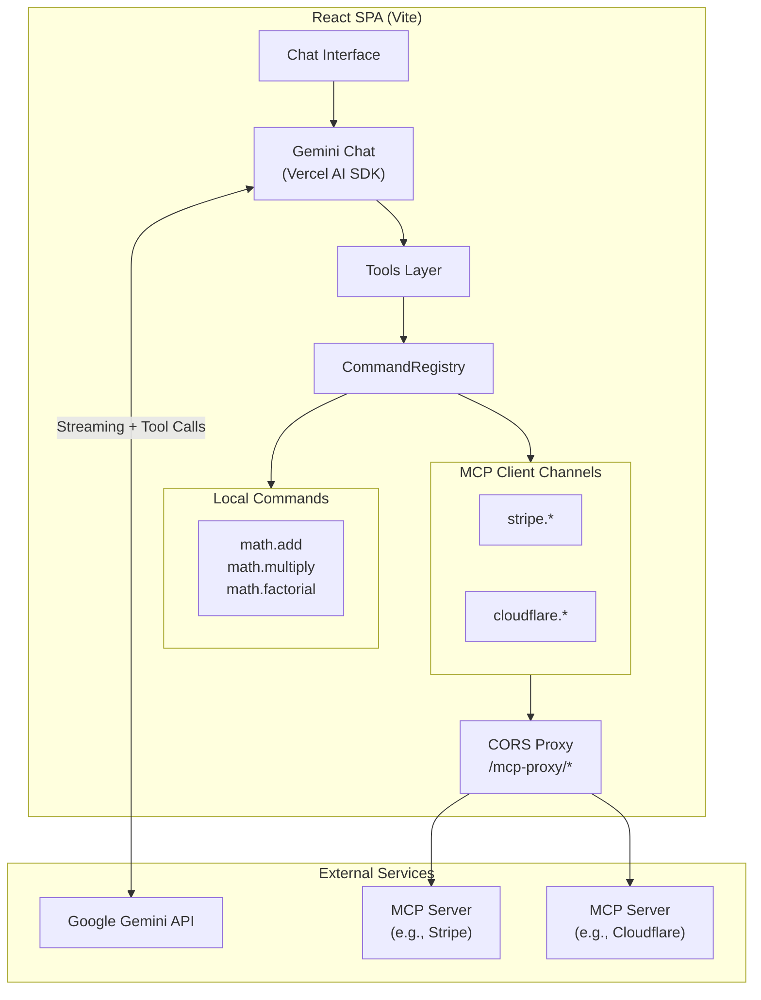
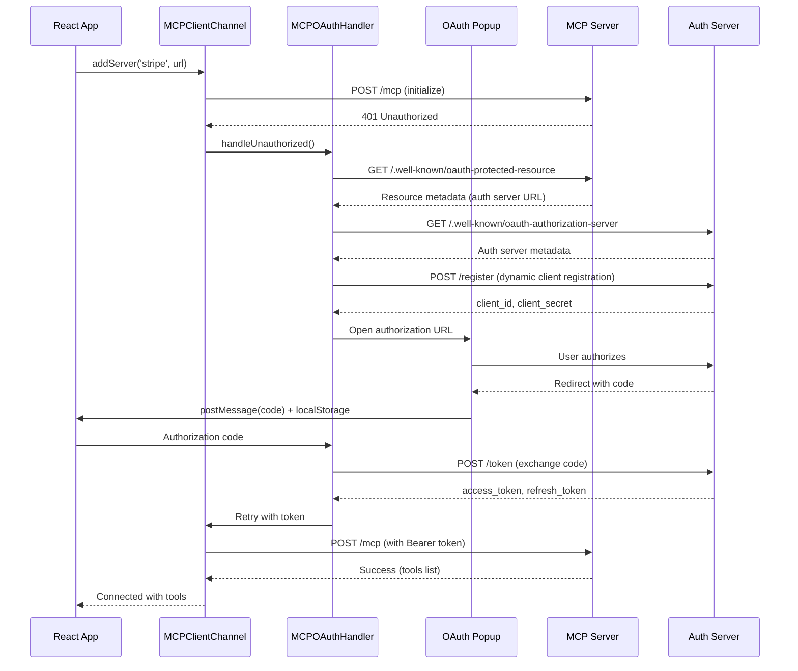

import { Aside } from '@astrojs/starlight/components';

The AI Agent MCP example demonstrates how to expose cmd-ipc commands as tools for AI agents, with support for connecting to external MCP servers. It uses the <a href="https://sdk.vercel.ai/" target="_blank" rel="noopener">Vercel AI SDK</a> to integrate with Google Gemini, showing how commands can be easily converted to tools for any AI agent framework.

## Architecture



## Overview

This example includes:

- **Pure client-side React SPA** (no backend required)
- **Real-time streaming chat** with Google Gemini 2.0 Flash
- **Local commands exposed as tools** via cmd-ipc CommandRegistry
- **Dynamic MCP server connections** - add/remove servers at runtime
- **Automatic OAuth handling** - seamlessly authenticates with protected MCP servers
- **CORS proxy** - connects to external MCP servers from the browser
- **Multi-step tool execution** - AI can chain multiple tool calls
- **Tool calls and results** displayed in the chat UI
- **Token usage tracking**

## Project Structure

```
examples/agent-mcp/
├── package.json
├── vite.config.ts
├── index.html
├── .env.example
└── src/
    ├── index.tsx              # Entry point
    ├── App.tsx                # Main app with tabs (Chat, MCP Servers)
    ├── styles.css             # Application styles
    │
    ├── agent/                 # AI agent integration
    │   ├── gemini-chat-transport.ts  # Gemini streaming transport
    │   └── list-tools.ts             # Converts commands to AI SDK tools
    │
    ├── commands/              # Local command definitions
    │   ├── command-registry.ts       # Shared CommandRegistry instance
    │   ├── command-schema.ts         # Command schemas (Valibot)
    │   └── calc-service.ts           # Calculator service commands
    │
    ├── components/            # React components
    │   ├── ChatTab.tsx               # Chat interface with Gemini
    │   ├── MCPServersTab.tsx         # MCP server management UI
    │   └── ToolsSidebar.tsx          # Available tools display
    │
    ├── mcp/                   # MCP server management
    │   └── mcp-server-manager.ts     # MCPClientChannel management
    │
    ├── middleware/            # Vite dev server middleware
    │   ├── index.ts                  # Middleware exports
    │   ├── mcp-proxy.ts              # CORS proxy for MCP servers
    │   └── spa-fallback.ts           # SPA routing for OAuth callbacks
    │
    └── utils/                 # Utility functions
        └── oauth-popup.ts            # OAuth popup and token storage
```

## Running the Example

```bash
yarn start:examples-agent-mcp
```

Open http://localhost:5173 and enter your Google AI API key.

## Adding MCP Servers

The example allows you to dynamically connect to external MCP servers at runtime:

1. Click the **MCP Servers** tab
2. Enter a server name (e.g., `stripe` or `cloudflare-docs`)
3. Enter the MCP server URL (e.g., `https://mcp.stripe.com`)
4. Click **Add Server**

The server's tools will be registered with the CommandRegistry using the server name as a prefix (e.g., `stripe.create_payment_link`). All tools appear in the sidebar and are available for the AI to use.

### MCP Server Manager

The `MCPServerManager` class handles connecting to external MCP servers:

```typescript
import { MCPClientChannel } from '@coralstack/cmd-ipc'

// Add a server - tools are automatically registered
await MCPServerManager.addServer('stripe', 'https://mcp.stripe.com')

// All tools from the server are now available with the prefix:
// stripe.create_payment_link, stripe.list_products, etc.

// Remove a server
await MCPServerManager.removeServer('stripe')

// Get all connected servers
const servers = MCPServerManager.getServers()

// Subscribe to server changes
const unsubscribe = MCPServerManager.subscribe((servers) => {
  console.log('Servers changed:', servers)
})
```

### CORS Proxy

Since browsers enforce CORS restrictions, the example includes a Vite middleware that proxies requests to external MCP servers:

```
/mcp-proxy/{protocol}/{host}/{path} → {protocol}://{host}/{path}
```

For example:
- `/mcp-proxy/https/mcp.stripe.com/mcp` → `https://mcp.stripe.com/mcp`

The proxy is implemented in `src/middleware/mcp-proxy.ts` and handles:
- Forwarding requests with proper headers
- CORS preflight (OPTIONS) requests
- Adding CORS headers to responses

## OAuth Authentication

When connecting to an MCP server that requires authentication, the example automatically handles the OAuth 2.1 flow.

### How OAuth Works



### OAuth Flow Steps

1. **Initial Request**: `MCPClientChannel` sends an initialize request to the MCP server
2. **401 Response**: Server responds with `401 Unauthorized` and a `WWW-Authenticate` header
3. **Metadata Discovery**:
   - Fetches Protected Resource Metadata (RFC 9728)
   - Fetches Authorization Server Metadata (RFC 8414)
4. **Dynamic Client Registration**: Registers the client dynamically (RFC 7591)
5. **Authorization**: Opens a popup for user authorization using PKCE (S256)
6. **Token Exchange**: Exchanges authorization code for tokens
7. **Retry Request**: Retries the original request with the access token

### OAuth Popup Implementation

The OAuth popup (`src/utils/oauth-popup.ts`) uses multiple methods to receive the callback:

```typescript
export function openOAuthPopup(authUrl: string): Promise<string> {
  return new Promise((resolve, reject) => {
    const popup = window.open(authUrl, 'oauth', 'width=600,height=700,popup=1')

    // Method 1: postMessage (primary)
    window.addEventListener('message', (event) => {
      if (event.data?.type === 'mcp-oauth-callback') {
        resolve(event.data.code)
        popup.close()
      }
    })

    // Method 2: localStorage (fallback for cross-origin redirects)
    const checkStorage = setInterval(() => {
      const stored = localStorage.getItem('mcp-oauth-callback')
      if (stored) {
        const data = JSON.parse(stored)
        resolve(data.code)
        popup.close()
      }
    }, 500)
  })
}
```

### Token Persistence

Tokens are persisted in localStorage so you don't need to re-authenticate on page reload:

```typescript
const localStorageTokenStorage: OAuthTokenStorage = {
  async get(serverUrl: string) {
    const key = `mcp-oauth-tokens:${serverUrl}`
    const stored = localStorage.getItem(key)
    return stored ? JSON.parse(stored) : null
  },

  async set(serverUrl: string, tokens: OAuthTokens) {
    const key = `mcp-oauth-tokens:${serverUrl}`
    localStorage.setItem(key, JSON.stringify(tokens))
  },

  async clear(serverUrl: string) {
    const key = `mcp-oauth-tokens:${serverUrl}`
    localStorage.removeItem(key)
  },
}
```

## Converting Commands to AI Tools

The key to integrating cmd-ipc with AI agents is converting commands to the tool format expected by the AI SDK. The `listCommands()` method provides all the information needed:

```typescript
// list-tools.ts
import type { ToolSet } from 'ai'
import { z } from 'zod'
import { CommandRegistry } from './command-registry'

export function listTools(): ToolSet {
  const commands = CommandRegistry.listCommands()

  const tools: ToolSet = {}
  for (const command of commands) {
    tools[command.id] = {
      description: command.description,
      inputSchema: command.schema?.request
        ? z.fromJSONSchema(command.schema.request)
        : z.unknown(),
      outputSchema: command.schema?.response
        ? z.fromJSONSchema(command.schema.response)
        : z.unknown(),
      execute: async (input) => {
        return await CommandRegistry.executeCommand(command.id, input)
      },
    }
  }

  return tools
}
```

### Using with Vercel AI SDK

```typescript
import { streamText } from 'ai'
import { google } from '@ai-sdk/google'
import { listTools } from './list-tools'

const result = await streamText({
  model: google('gemini-2.0-flash'),
  tools: listTools(),
  maxSteps: 5,  // Allow multi-step tool execution
  messages: [{ role: 'user', content: 'What is 5 factorial?' }],
})
```

### Using with OpenAI SDK

```typescript
import OpenAI from 'openai'

const openai = new OpenAI()
const commands = CommandRegistry.listCommands()

// Convert to OpenAI tool format
const tools = commands.map(cmd => ({
  type: 'function' as const,
  function: {
    name: cmd.id,
    description: cmd.description,
    parameters: cmd.schema?.request || { type: 'object', properties: {} },
  },
}))

const response = await openai.chat.completions.create({
  model: 'gpt-4',
  tools,
  messages: [{ role: 'user', content: 'What is 5 factorial?' }],
})

// Handle tool calls
for (const toolCall of response.choices[0].message.tool_calls || []) {
  const args = JSON.parse(toolCall.function.arguments)
  const result = await CommandRegistry.executeCommand(toolCall.function.name, args)
  // Send result back to model...
}
```

### Using with Anthropic SDK

```typescript
import Anthropic from '@anthropic-ai/sdk'

const anthropic = new Anthropic()
const commands = CommandRegistry.listCommands()

// Convert to Anthropic tool format
const tools = commands.map(cmd => ({
  name: cmd.id,
  description: cmd.description,
  input_schema: cmd.schema?.request || { type: 'object', properties: {} },
}))

const response = await anthropic.messages.create({
  model: 'claude-sonnet-4-20250514',
  max_tokens: 1024,
  tools,
  messages: [{ role: 'user', content: 'What is 5 factorial?' }],
})

// Handle tool use
for (const block of response.content) {
  if (block.type === 'tool_use') {
    const result = await CommandRegistry.executeCommand(block.name, block.input)
    // Send result back to model...
  }
}
```

### Using with LangChain

```typescript
import { tool } from '@langchain/core/tools'
import { z } from 'zod'
import { ChatOpenAI } from '@langchain/openai'

const commands = CommandRegistry.listCommands()

// Convert commands to LangChain tools
const tools = commands.map(cmd =>
  tool(
    async (input) => {
      const result = await CommandRegistry.executeCommand(cmd.id, input)
      return JSON.stringify(result)
    },
    {
      name: cmd.id.replace(/\./g, '_'),  // LangChain requires underscores
      description: cmd.description || '',
      schema: cmd.schema?.request
        ? z.object(cmd.schema.request.properties as any)
        : z.object({}),
    }
  )
)

const model = new ChatOpenAI({ model: 'gpt-4' }).bindTools(tools)
const response = await model.invoke('What is 5 factorial?')
```

### Using with LangGraph

```typescript
import { tool } from '@langchain/core/tools'
import { z } from 'zod'
import { ChatOpenAI } from '@langchain/openai'
import { createReactAgent } from '@langchain/langgraph/prebuilt'

const commands = CommandRegistry.listCommands()

// Convert commands to LangGraph-compatible tools
const tools = commands.map(cmd =>
  tool(
    async (input) => {
      const result = await CommandRegistry.executeCommand(cmd.id, input)
      return JSON.stringify(result)
    },
    {
      name: cmd.id.replace(/\./g, '_'),
      description: cmd.description || '',
      schema: cmd.schema?.request
        ? z.object(cmd.schema.request.properties as any)
        : z.object({}),
    }
  )
)

// Create a ReAct agent with cmd-ipc tools
const agent = createReactAgent({
  llm: new ChatOpenAI({ model: 'gpt-4' }),
  tools,
})

// Stream agent responses
const stream = await agent.stream({
  messages: [{ role: 'user', content: 'What is 5 factorial?' }],
})

for await (const chunk of stream) {
  console.log(chunk)
}
```

<Aside type="tip">
  The `listCommands()` method returns JSON Schema definitions for request/response, making it easy to integrate with any AI framework that supports function calling.
</Aside>
