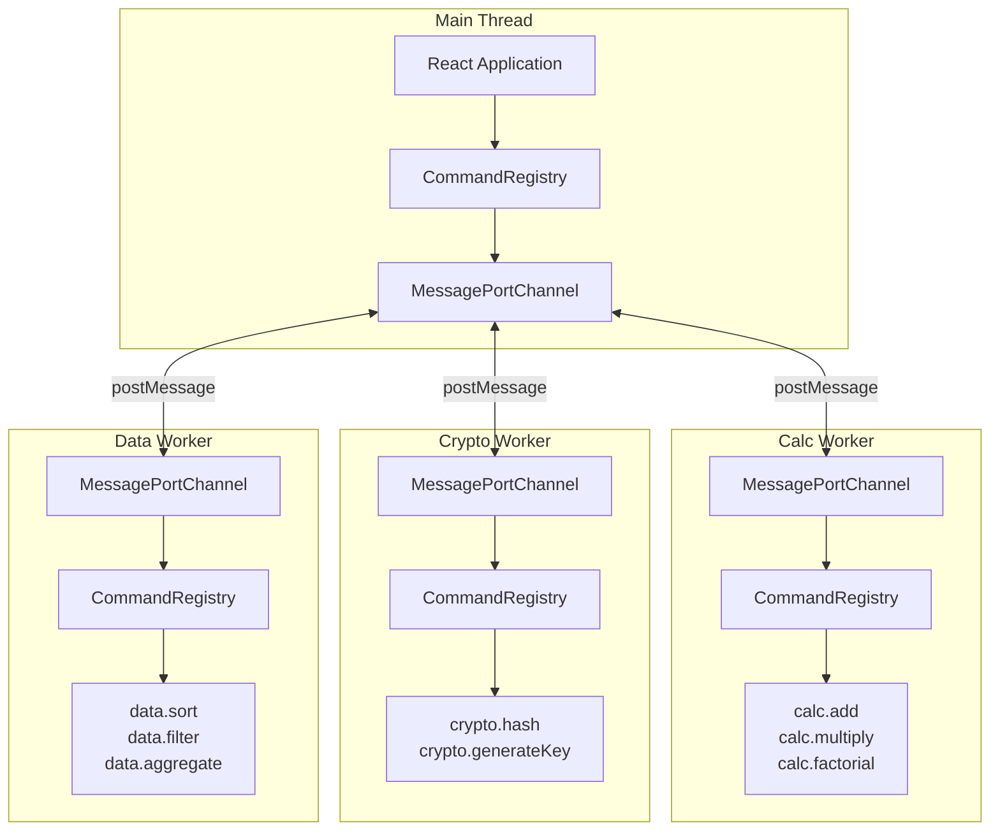

import { Aside } from '@astrojs/starlight/components';

The Web Workers example demonstrates how to offload heavy computation to background threads while maintaining a responsive UI and full type safety. Each worker runs in an isolated iframe sandbox, demonstrating how to securely execute untrusted code. This pattern is ideal for plugin architectures where third-party plugins run in isolated workers and can register their own commands and events while calling commands from other processes.

## Architecture



## Overview

This example includes:

- **React + Vite** frontend with a calculator UI
- **Multiple Web Workers** running different operations in the background (calc, crypto, data)
- **MessagePortChannel** for main thread ↔ worker communication
- **Shared schemas** for type-safe commands across all workers
- **Iframe sandbox** demonstrating isolated execution environments

## Project Structure

```
examples/web-workers/
├── package.json
├── vite.config.ts
├── index.html
└── src/
    ├── main.tsx              # App entry point
    ├── App.tsx               # React component
    ├── styles.css            # Styling
    ├── ipc/
    │   ├── command-schema.ts # Command schemas
    │   ├── event-schema.ts   # Event schemas
    │   └── channel-ids.ts    # Channel identifiers
    ├── sandbox/              # Iframe sandbox factory
    └── workers/
        ├── calc.worker.ts    # Calculator operations
        ├── crypto.worker.ts  # Cryptographic operations
        └── data.worker.ts    # Data processing operations
```

## Running the Example

```bash
yarn start:examples-web-workers
```

Open http://localhost:5173 to see the application.
