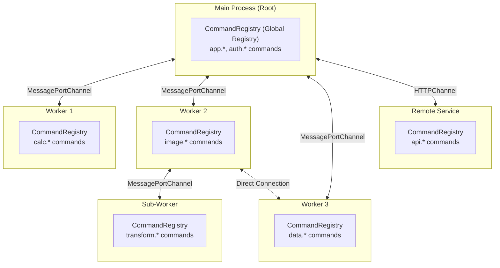
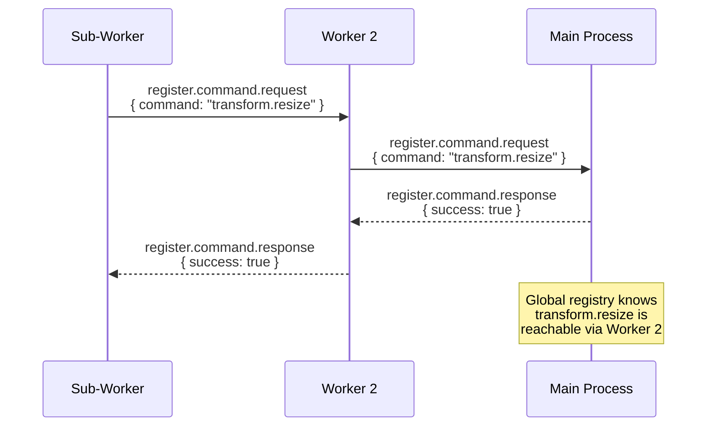
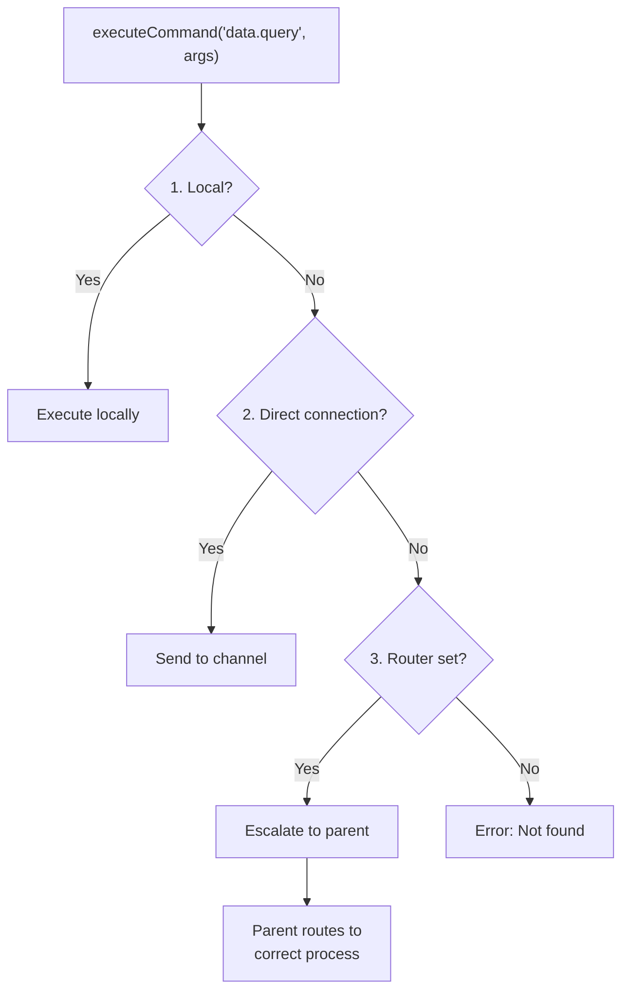

import { Aside } from '@astrojs/starlight/components'

cmd-ipc uses a **Service Mesh Tree** protocol that combines hierarchical tree routing with flexible mesh connectivity. This architecture enables any process to call any command across your entire application, regardless of where that command is registered. It also allows for direct connections between processes that communicate frequently, so they don't have to route via the root process.

The messaging [Protocol](/cmd-ipc/introduction/protocol/) can be extended over a network via HTTP, WebSockets, gRPC, etc. to discover and execute commands on remote services. This provides a consistent developer experience—calling a command works exactly the same whether it's local to the current process, in another process, or on a remote service. Developers don't need to know how to route requests and responses over the Service Mesh Tree.



## Core Concepts

### CommandRegistry

Each process has a `CommandRegistry` that stores local command handlers, tracks remote commands from connected channels, and routes command execution to the correct location.

```typescript
const registry = new CommandRegistry({
  id: 'main',
  routerChannel: 'parent', // Optional: escalate unknown commands up the tree
})
```

### Channels

Channels are bidirectional communication pipes between registries. When a channel connects, commands are automatically discovered and registered.

```typescript
const channel = new MessagePortChannel('worker', port)
await registry.registerChannel(channel)
// Registry now knows about all commands from the worker
```

### Commands & Events

**Commands** are request-response operations that can be local or remote. **Events** are fire-and-forget broadcasts to all connected registries. Both can be made **private** (prefixed with `_`) to prevent propagation to other processes.

## How Routing Works

The Service Mesh Tree protocol has two key mechanisms:

### 1. Command Registration (Up the Tree)

When a channel connects, commands register **up the tree** to the root. Each registration returns a response acknowledging success or an error if the command ID is already registered. This ensures the main process always has a complete global registry of all commands and the routing path to reach them.



### 2. Command Execution (Find & Route)

When a command is called, the routing follows this priority:



**Example: Sub-Worker calling `data.query`**

1. **Local?** No (Sub-Worker only has `transform.*`)
2. **Direct connection?** No (only connected to Worker 2)
3. **Escalate to Worker 2** → Worker 2 has direct connection to Worker 3 → Routes directly
4. Worker 3 executes and returns result

<Aside type="tip">
  Direct mesh connections (like Worker 2 ↔ Worker 3) optimize routing by avoiding unnecessary hops
  through the root. The tree structure ensures commands are always discoverable, while mesh
  connections provide shortcuts.
</Aside>

